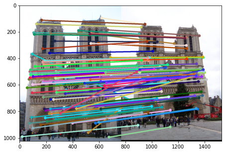

# Computer_Vision_Implementations

 This repository contains my implementation of different Classical computer vision and Deep learning algorithms

 ## Python Implementations

 Open the .IPYNB files to check the implementation and results of every project

**sift_detection:** This project contains my implementation of the SIFT detector. I implemented Harris corner to detect the edges and Keypoints and SIFT to describe each keypoint.

 

**fully_connected_network for image classification:** In this project I used NumPy to build forward and backward passes for fully connected layers and activation functions. I used the built layers to build an image classifier but couldn't get good performance because I wasn't able to initialize the weights in Xavier distribution.

**convolutional_network for image classification:** In this project I built Convolution layers and batch normalization layers to improve the networks performance compared to fully connected layers. Ended up getting similar results using convolution layers.

Below is a plot of filters from the intermediate layers, they show that the model is learning meaningful features

**visual_odometry:** In this project I implemented Visual Odometry on Kitti Dataset. I used SIFT to detect and compute features, and matched them. I used the matches to compute the essential matrix and pose between frames from it.

Below is a plot of Ground truth and generated trajectory
Red dots denote ground-truth camera poses and green ones are the estimations

## C++ Implementations

**camera_calibration_augmented_reality:**  In this project I implemented camera calibration using a checkerboard and projected a 3D object on to the checkerboard plane

**command to run and build the executable:**

`g++ main_vid.cpp -o main_vid -I /usr/local/include -L /usr/local/lib -lopencv_core -lopencv_highgui -lopencv_imgproc -lopencv_imgcodecs -lopencv_videoio -lopencv_calib3d`

**shown a prompt:** Save image or not?: `1 or 0` > The user must type either `1` for Yes or `0` for No and press enter.

These images are essentially frames where the chessboard corners are detected. 

If the user selects `1` in the previous step, another prompt is shown: "Choose Augmentation: `axes`, `cube`, `pillars`:" the user must type one of them

**press** `s`: With chessboard in the frame when s is pressed the program extracts the chessboard corners. This process is repeated 5 times at least before the user is prompted: `Run Calibration on images: 1 or 0:` > The user must type either `1` for Yes or `0` for No and press enter.

**press** `t`: With chessboard in frame when 't' is pressed the program shows the image of the chessboard with the augmented 

**press** `h`: With pattern in frame when 'h' is pressed the program shows the harris corner extracted image of the pattern 

**press** `q`: The program quits

**content_based_image_retrieval:** In this project I Used pixel manipulation techniques and histograms to compare the difference between query image and dataset

**command to run and build the executable:**

`g++ main_content.cpp -o main_content -I /usr/local/include -L /usr/local/lib -lopencv_core -lopencv_highgui -lopencv_imgproc -lopencv_imgcodecs -lopencv_videoio -lopencv_calib3d`

Enter 1 to start 0 to exit - Enter `1` or `0`

Save CSV? : 1 or 0 - Enter `1`for Yes and `0`for No (Required if you don't use the CSV 								       file I attached)

Run compare? : 1 or 0 - Enter `1` for Yes and `0` for No

Compare type (baseline, hist, multihist, texcolor) - Enter `baseline` or `hist` ....

Input image name - Enter `pic.0164` or any other image name in same format

Input number of images to output - Enter a number like `2`, `3`, `4`....

Continue? : 1 or 0 - Enter `1` for Yes and `0` for No

**realtime_object_recognition:** In this project I classified objects using unique properties and extracting distinctive features for each image. Used the similarities in features from the image and dataset to recognize the object

**command to run and build the executable:**

`g++ -v main_rec.cpp -o main_obj -I /usr/local/include -L /usr/local/lib -lopencv_core -lopencv_highgui -lopencv_imgproc -lopencv_imgcodecs -lopencv_videoio -lopencv_calib3d`

**press** `x`: then the program computes threholded image of object in frame, cleanup of the threshold image using dilation and erosion, computes segmentation based on colors, computes the bounding box and axis of least central moment around the biggest

**press** `t`: the program goes into training mode and all the computation for the specific image takes place and the user is prompted to enter the object name and the frame is saved in 'database.csv'

**realtime_filtering:** In this project I implemented various filters from scratch

**command to run and build the executable:** We will be building two executables in this project one for image and one for video

For Video

`g++ main_vid.cpp -o main_vid -I /usr/local/include -L /usr/local/lib -lopencv_core -lopencv_highgui -lopencv_imgproc -lopencv_imgcodecs -lopencv_videoio -lopencv_calib3d`

For Image

`g++ main_img.cpp -o main_img -I /usr/local/include -L /usr/local/lib -lopencv_core -lopencv_highgui -lopencv_imgproc -lopencv_imgcodecs -lopencv_videoio -lopencv_calib3d`

filter.h - contains all function definitions

filter.cpp - contains all functions bodies

main_video.cpp - displays a video window that displays live video and a image window that displays the output of live video frame with after filtering (the type of filtering depends on the key pressed).   

main_img.cpp - displays an image when the location is given and exits code upon pressing 'q'.

In the extension the implemenation of erosion and dilation filtering has been performed where the size of the kernel is 5*5. Press '1' to get dilated image and '2' to get eroded image while vidDisplay.cpp is running. 
